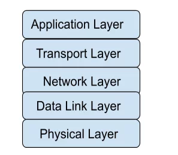

# System Design Learning

This repository contains my learnings and resources related to system design.

## Introduction

Welcome to my repository dedicated to system design learning! Here, I've gathered resources, notes, and insights gained from studying various aspects of system design.

## What's Included

- Notes from online courses, tutorials, and books.
- Code snippets and examples related to system design concepts.
- Links to helpful articles, blog posts, and videos.
- Personal reflections and insights on system design principles and best practices.

## How to Use This Repository

Feel free to explore the contents of this repository to deepen your understanding of system design. Here's how you can navigate through the materials:

1. **Notes:** Check the `notes` directory for detailed notes organized by topics or concepts.
2. **Code Examples:** Browse through the `code` directory for practical examples and implementations.
3. **Resources:** Visit the `resources` directory for links to external resources such as articles, tutorials, and videos.
4. **Reflections:** Read my reflections and insights in the `reflections.md` file.

# System Design 

## Main Terminologies

1. **Vertical scaling:** Vertical scaling optimizes processes and increases throughput    using the same resource.Preparing resources beforehand during non-peak hours improves efficiency in handling orders.Having backups and avoiding single points of failure are crucial for system resilience.

2. **Horizontal scaling:** Horizontal scaling involves buying more machines of similar types to distribute workload.Routing orders based on employee strengths improves efficiency in task allocation.

3. **Microservice architecture:** Microservice architecture helps in scaling teams at different rates and dividing responsibilities.

4. **Distributed systems:** Distributed systems increase fault tolerance and provide quicker response times.

5. **Load balancers:** Load balancers route requests efficiently, enhancing fault tolerance and profitability.

 * Decoupling systems separates concerns, improving efficiency in handling separate systems.
 * Logging events and metrics aids in understanding system behavior and performance.
 * Extensible systems allow for scalability and adaptation to changing requirements.
 * High-level system design focuses on deploying servers and system interactions.
 * Low-level system design involves coding specifics like classes, objects, and functions.

    ### Capacity Estimation 

    Capacity estimation refers to estimating the resources needed to support a certain system or product in terms of storage, bandwidth, number of users, etc. It is an important part of the system design process as it helps determine hardware requirements, scalability planning, and costs.

    ### What is http ?
    * HyperText Transfer Protocol(HTTP) is an application layer protocol that is used to access and transfer data(text, images, video, multimedia, etc) over the world wide web.
    * HTTP is a client-server protocol that runs on top of the TCP/IP family of protocols and uses the request/response protocol.
    * HTTP uses port number 80. Features are connectionless , media independent , stateless

    ### What is https ?
    * This protocol allows transferring the data in an encrypted form which is particularly important when users transmit sensitive data such as login credentials.

    * To encrypt communications HTTPS uses an encryption protocol called Transport Layer Security (TLS), formerly known as Secure Sockets Layer (SSL). It uses 443 port.

    ### TCP Model 
    * TCP is a set of communication protocols that supports network communication.

    

    * Physical Layer - Converts data bits into signals for transmission over physical media.
    * Data Link Layer - Handles framing, MAC addressing, flow and error control.
    * Network Layer - Adds IP addressing and routing to choose paths for data delivery.
    * Transport Layer - Provides segmentation, flow control, connectivity and reliability.
    * Application Layer - Allows users to access network resources through protocols    like HTTP, DNS, SMTP etc.

## Contributing

If you have any additional resources, notes, or insights related to system design that you'd like to share, feel free to contribute! Simply fork this repository, make your changes, and submit a pull request.

## Acknowledgments

I'd like to express my gratitude to all the educators, authors, and developers whose work has contributed to my understanding of system design.

## Contact

If you have any questions, suggestions, or feedback, feel free to reach out to me.

Happy learning!
# Devops-Learning
